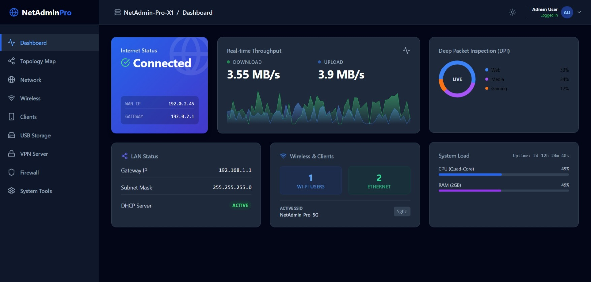
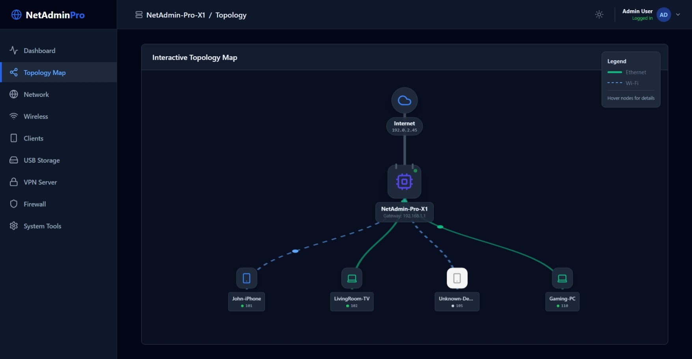
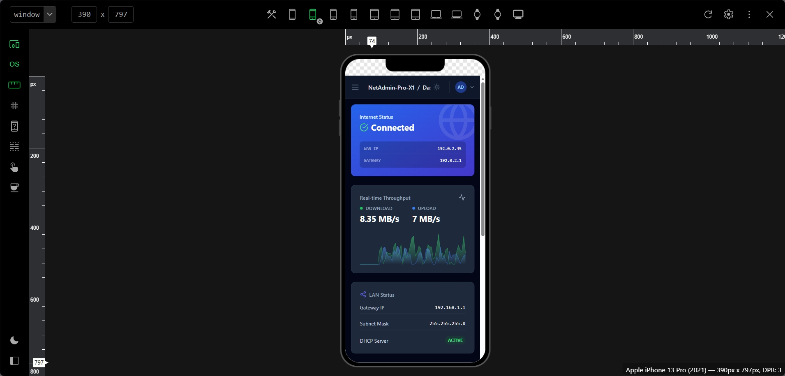

# NetAdmin Pro 🚀  
### Virtual Router Management & Network Simulation Dashboard
NetAdmin Pro is a **fully interactive, enterprise-style router management interface** built using modern frontend technologies.  
It simulates real-world router functionalities such as WAN/LAN configuration, firewall rules, VPN setup, CLI commands, and network topology visualization — similar to professional router firmware (Cisco, MikroTik, OpenWRT).

🔗 **Live Demo:**  
https://adityaraj3136.github.io/netadmin-pro/

---

## ✨ Key Features

### 🔐 Authentication
- Secure admin login simulation
- Session-based UI access 

### 🌐 Network Management
- WAN configuration (DHCP / Static / PPPoE)
- LAN & DHCP server settings
- VLAN (802.1Q) configuration
- Dynamic DNS (DDNS)

### 📡 Wireless Management
- Wi-Fi enable/disable
- Security modes (Open / WPA2 / WPA3)
- Guest network with isolation
- Real-time Wi-Fi channel analyzer

### 🧱 Security & Firewall
- Stateful firewall toggle
- Port forwarding rules
- DoS / DDoS protection simulation
- Parental control & scheduling

### 🔒 VPN Server
- WireGuard & OpenVPN UI
- Client configuration generation

### 🖥️ Client Monitoring
- Connected devices (Wi-Fi / Ethernet)
- Live bandwidth usage simulation
- Block / unblock devices
- Parental access rules

### 🧠 System Tools
- Built-in CLI terminal (ping, traceroute, reboot, reset)
- Router reboot & factory reset simulation
- Configuration backup & restore

### 🗺️ Network Topology Map
- Interactive visual topology
- Internet → Router → Clients
- Hover-based device details
- Live packet animation

### 🎮 Troubleshooting Mode
- Gamified network fault scenarios
- Diagnose and fix common network issues
- Engineer-style problem solving

### 🌙 UI / UX
- Dark & light mode (firmware-style)
- Responsive dashboard layout
- Modern enterprise UI

---

## 🛠️ Tech Stack

- **Frontend:** React + Vite
- **Styling:** Tailwind CSS (v3)
- **Icons:** Lucide React
- **State Management:** React Hooks
- **Build Tool:** Vite
- **Deployment:** GitHub Pages

---

## 📸 Screenshots

### 🔐 Login Screen


### 📊 Dashboard Overview


### 🗺️ Network Topology Map


### 🌙 Dark Mode Interface



## 📦 Installation & Local Setup

```bash
# Clone the repository
git clone https://github.com/adityaraj3136/netadmin-pro.git

# Navigate to project folder
cd netadmin-pro

# Install dependencies
npm install

# Start development server
npm run dev
